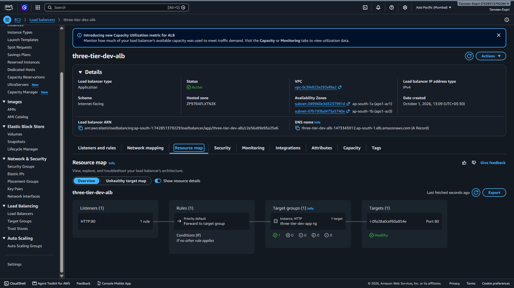
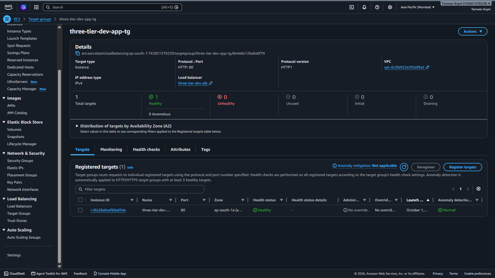
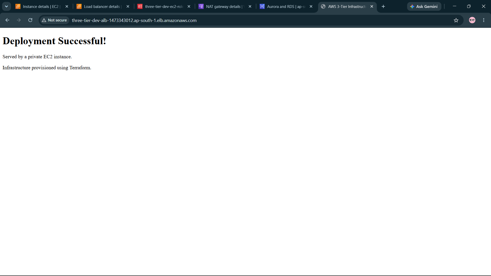
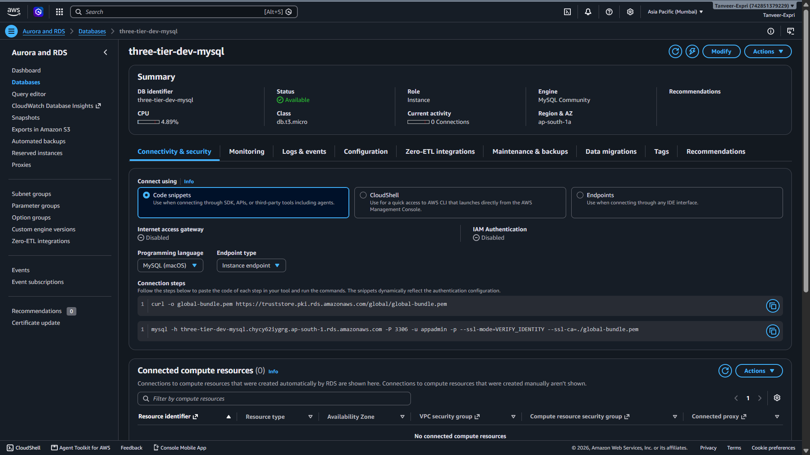
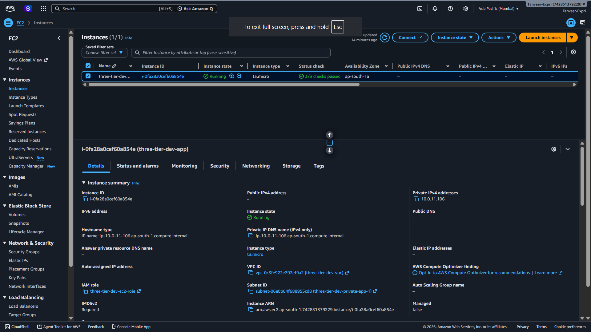
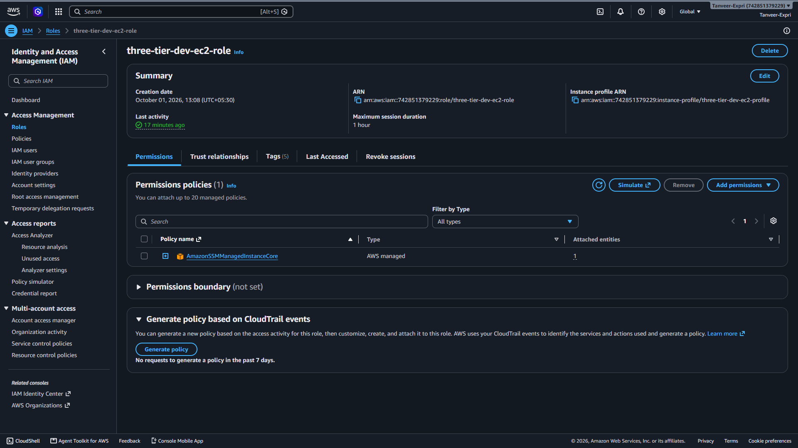

# ☁️ AWS 3-Tier Infrastructure with Terraform

<p align="center">
  <strong>Secure, modular, repeatable AWS infrastructure provisioned as code.</strong>
</p>

<p align="center">
  
  
  
  
  
</p>

---

## 📌 Project Overview

This project provisions a **three-tier-style AWS infrastructure using Terraform**. It separates public entry-point resources from the private application and database layers, with security groups controlling communication between tiers.

An internet-facing **Application Load Balancer (ALB)** forwards HTTP requests to **Nginx running on a private Ubuntu EC2 instance**. An **Amazon RDS for MySQL** database is deployed in private database subnets and is not publicly accessible.

The infrastructure is managed as code, making it repeatable, reviewable, and easier to clean up after testing.

> **Scope note:** This is a portfolio/learning project with a production-style design, not a fully production-hardened or highly available system. The current configuration uses one application EC2 instance, a single-AZ RDS instance, HTTP on the ALB, and one NAT Gateway.

## 🎯 Objectives

- 🧱 Provision infrastructure using reusable Terraform modules.
- 🌐 Serve a web page through an internet-facing Application Load Balancer.
- 🔒 Keep the application server and database in private subnets.
- 🧱 Restrict traffic between tiers using security groups.
- 🪪 Configure an EC2 IAM role and instance profile for Systems Manager.
- 🗄️ Deploy encrypted Amazon RDS for MySQL.
- 🔁 Practise Terraform formatting, validation, planning, deployment, testing, and teardown.
- 📸 Document the deployment with real AWS console screenshots.

## 🏗️ Architecture

```text
                         🌍 Internet
                              |
                              v
                  +-----------------------+
                  | Application Load      |
                  | Balancer (HTTP :80)   |
                  | Public subnets        |
                  +-----------------------+
                              |
                         HTTP :80
                              |
                              v
                  +-----------------------+
                  | Private EC2 Instance  |
                  | Ubuntu 24.04 + Nginx  |
                  | Application tier      |
                  +-----------------------+
                              |
                        MySQL :3306
                              |
                              v
                  +-----------------------+
                  | Amazon RDS for MySQL  |
                  | Private DB subnets    |
                  | Not publicly accessible|
                  +-----------------------+

VPC CIDR:             10.0.0.0/16
Public subnets:       10.0.1.0/24, 10.0.2.0/24
Private app subnets:  10.0.11.0/24, 10.0.12.0/24
Private DB subnets:   10.0.21.0/24, 10.0.22.0/24

Internet Gateway: public-subnet internet connectivity
NAT Gateway:      outbound internet access for the app tier
```

### 🔄 Request flow

1. A user opens the ALB DNS name in a browser.
2. The ALB receives the request on HTTP port `80`.
3. The ALB forwards the request to the registered EC2 target on port `80`.
4. Nginx on the private EC2 instance returns the demo page.
5. RDS accepts MySQL traffic only from the application security group.

> The demo page proves the ALB-to-EC2 web path. It does **not** prove that the application is querying the RDS database.

## 🧰 AWS Services and Tools

| Service / Tool | Purpose |
|---|---|
| **Terraform** | Infrastructure as Code (IaC) |
| **Amazon VPC** | Isolated network |
| **Public/private subnets** | Network separation |
| **Internet Gateway** | Internet access for public subnets |
| **NAT Gateway** | Outbound access for private application resources |
| **Application Load Balancer** | Public entry point and traffic forwarding |
| **Amazon EC2** | Private Ubuntu application server |
| **Nginx** | Serves the demo web page |
| **Amazon RDS for MySQL** | Managed relational database |
| **AWS IAM** | EC2 role and instance profile |
| **AWS Systems Manager** | Intended private-instance management access |
| **Security Groups** | Control traffic between tiers |

## 🔐 Security Design

- 🔒 The EC2 application instance has no public IP and runs in a private subnet.
- 🔒 RDS is configured with `publicly_accessible = false`.
- 🧱 The ALB security group allows inbound HTTP on port `80`.
- 🧱 The application security group allows port `80` only from the ALB security group.
- 🧱 The database security group allows MySQL port `3306` only from the application security group.
- 🪪 The EC2 instance uses an IAM role/instance profile with `AmazonSSMManagedInstanceCore`.
- 🔐 RDS storage encryption is enabled.
- 🚫 Database passwords and Terraform state must not be committed to Git.

### ⚠️ Production hardening to consider

Add HTTPS using ACM, multiple application instances with Auto Scaling, Multi-AZ RDS where appropriate, monitoring and alarms, managed secrets, protected remote Terraform state and locking, and a deliberate backup/deletion-protection policy. A single NAT Gateway creates an Availability Zone dependency and may incur cross-AZ data charges.

## 📂 Repository Structure

```text
aws-terraform-3tier-infrastructure/
├── versions.tf
├── providers.tf
├── main.tf
├── variables.tf
├── outputs.tf
├── .gitignore
└── modules/
    ├── vpc/{main.tf,variables.tf,outputs.tf}
    ├── security/{main.tf,variables.tf,outputs.tf}
    ├── iam/{main.tf,variables.tf,outputs.tf}
    ├── ec2/{main.tf,variables.tf,outputs.tf}
    ├── alb/{main.tf,variables.tf,outputs.tf}
    └── rds/{main.tf,variables.tf,outputs.tf}
```

## 📸 Screenshots / Deployment Evidence

Create `docs/images/` in the repository, save your screenshots there using the filenames below, and commit them with the README. Use screenshots from your actual deployment. **Crop or blur account IDs and other sensitive details** before publishing.

```text
docs/
└── images/
    ├── 01-alb-resource-map.png
    ├── 02-target-group-healthy.png
    ├── 03-application-running.png
    ├── 04-rds-available.png
    ├── 05-private-ec2-instance.png
    └── 06-iam-role.png
```

### 1. 🗺️ ALB resource map

Shows the HTTP listener, forwarding rule, target group, and registered target.



### 2. 💚 Healthy target group

Shows the EC2 target registered and passing its health check.



### 3. 🌐 Application running

Shows the demo page served through the ALB DNS name.



### 4. 🗄️ RDS instance available

Shows the database status and engine/class. Never include credentials.



### 5. 🖥️ Private EC2 instance

Show the instance state, private subnet, and absence of a public IPv4 address.



### 6. 🪪 EC2 IAM role

Show the role and its intended SSM managed policy.



> GitHub displays a broken image if a referenced file is missing. Remove a screenshot section until its image is added, or change the path to match your actual filename.

## ⚙️ Prerequisites

- [Terraform](https://developer.hashicorp.com/terraform/install)
- [AWS CLI](https://docs.aws.amazon.com/cli/latest/userguide/getting-started-install.html)
- Git
- An AWS account with permissions to create the required resources
- AWS CLI authentication for the intended account

The examples use `ap-south-1` (Mumbai). Review current AWS pricing for your account and region before creating resources.

## 🚀 Deploy the Project

### 1. Clone the repository

```bash
git clone https://github.com/tanveerrabbani5/aws-terraform-3tier-infrastructure.git
cd aws-terraform-3tier-infrastructure
```

### 2. Verify AWS identity and region

```bash
aws sts get-caller-identity
aws configure get region
```

Confirm that the identity and region are correct. Do not publish the identity output because it contains account details.

### 3. Initialise, format, and validate

```bash
terraform init
terraform fmt -recursive
terraform validate
```

### 4. Supply the database password

The root module expects a sensitive `db_password` variable. You can enter it when Terraform prompts you. Alternatively, use a local, untracked `terraform.tfvars` file:

```hcl
db_password = "REPLACE_WITH_A_STRONG_PASSWORD"
```

Make sure `terraform.tfvars` is in `.gitignore`. Replace the placeholder with a strong password that satisfies RDS requirements. Never commit the password. Sensitive values can still be stored in Terraform state, so protect state files too.

### 5. Review the plan

```bash
terraform plan -out=tfplan
terraform show -no-color tfplan
```

Review the account, region, proposed resource changes, and possible charges. A Terraform plan is not a billing estimate.

### 6. Create the infrastructure only when ready

```bash
terraform apply tfplan
```

Run this only after reviewing the plan and consciously approving the potential AWS charges.

### 7. Verify the deployment

```bash
terraform output -raw alb_dns_name
```

Open the resulting DNS name in a browser using `http://`. The page should display **“Deployment Successful!”**. In the EC2 console, confirm that the target group target is healthy. In the RDS console, confirm that the database status is `Available`.

## 💸 Cost Management and Cleanup

Resources such as a NAT Gateway, ALB, EC2, RDS, and public IPv4 addresses may incur charges while provisioned or in use. Storage, backups, snapshots, and data transfer may also cost money. Actual charges depend on region, usage, account eligibility, and current AWS pricing.

If the project is finished and you have saved the evidence you need, destroying the Terraform-managed infrastructure is a sensible way to avoid leaving these resources running.

### 🧹 Destroy the infrastructure

1. Save your screenshots and any data you want to keep.
2. Confirm you are in the correct repository, AWS account, region, and Terraform workspace.
3. Review the destruction plan:

```bash
terraform plan -destroy
```

4. If it lists the resources you intend to remove, run:

```bash
terraform destroy
```

Read the plan and confirmation prompt carefully before typing `yes`.

> ⚠️ **Database warning:** The current RDS configuration has `skip_final_snapshot = true` and deletion protection disabled. Destroying it can permanently delete the database without creating a final snapshot. Export or back up anything you need first.

After destruction, verify in the AWS console that the ALB, EC2 instance, RDS instance, NAT Gateway, and other project resources are gone. Check for leftovers such as EBS volumes, snapshots, and Elastic IPs. Keep the Terraform configuration and state until cleanup is verified; never commit state files to Git.

`terraform destroy` removes resources tracked in the current Terraform state. It does not automatically remove unrelated resources or resources created manually outside that state.

## 🧠 What I Learned

- Designing a VPC with public and private subnet tiers.
- Structuring reusable Terraform modules with inputs and outputs.
- Restricting tier-to-tier traffic with security groups.
- Serving a web application from a private EC2 instance through an ALB.
- Provisioning an encrypted, private RDS for MySQL instance.
- Configuring an EC2 IAM role and instance profile for SSM integration.
- Using Terraform format, validate, plan, apply, verification, and destroy workflows.
- Capturing deployment evidence and considering cloud security and cost trade-offs.

## 🔭 Future Improvements

- 🔐 Add HTTPS using AWS Certificate Manager (ACM).
- ♻️ Use an Auto Scaling Group with multiple application instances across Availability Zones.
- 🗄️ Evaluate Multi-AZ RDS and safer backup/deletion-protection settings.
- 🔑 Store database credentials in AWS Secrets Manager.
- 📊 Add CloudWatch dashboards, alarms, and useful logs.
- 🧪 Add CI checks and infrastructure security scanning.
- 🧾 Configure a protected remote Terraform backend with state locking.
- 🌐 Evaluate VPC endpoints and NAT options for cost and availability.

## 👨‍💻 Author

**Tanveer Rabbani**  
B.Tech Information Technology | Cloud & DevOps Learner

- LinkedIn: [Tanveer Rabbani](https://www.linkedin.com/in/tanveer-rabbani-a-870729362/)
- GitHub: [@tanveerrabbani5](https://github.com/tanveerrabbani5)

---

⭐ If you find this project useful, explore the repository and share feedback.
